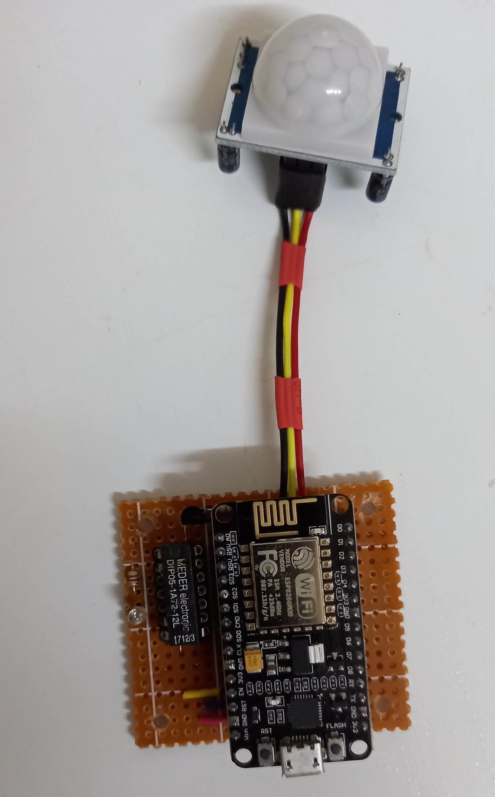
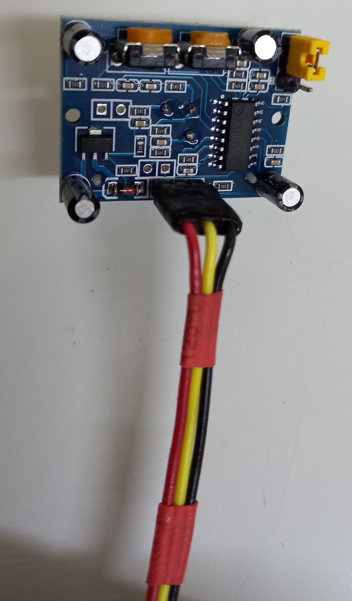
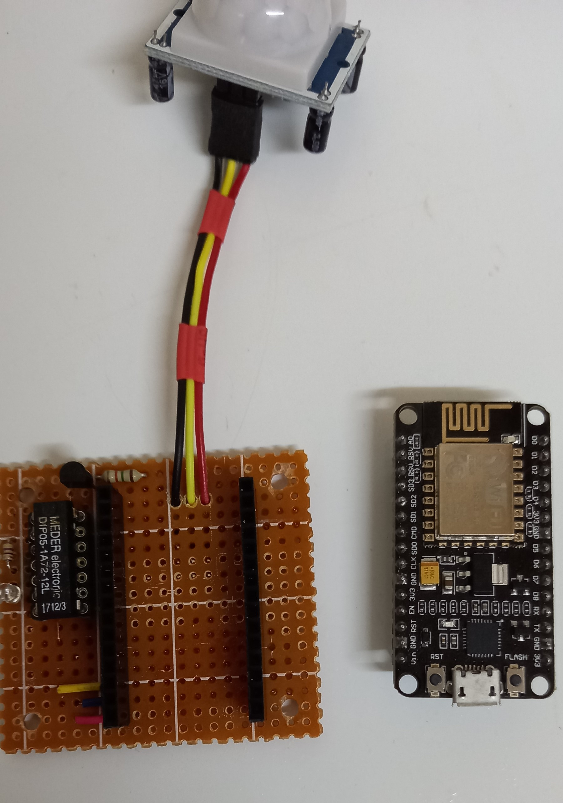
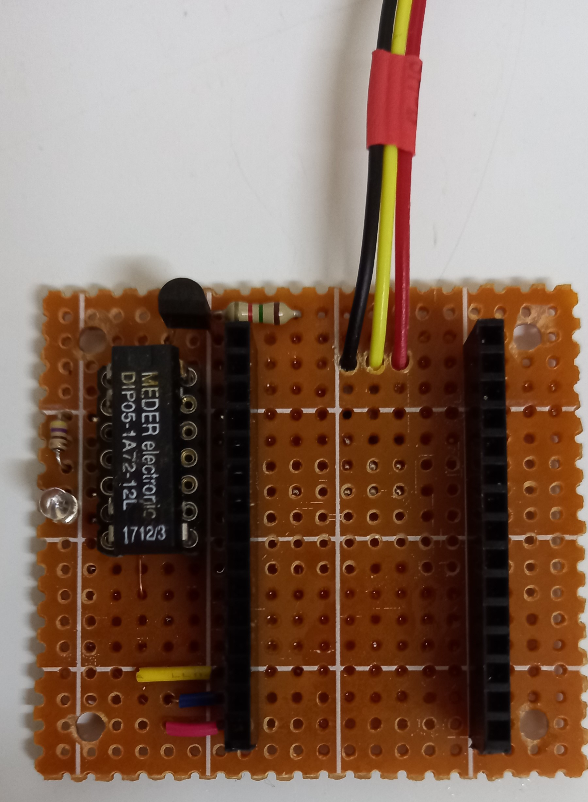
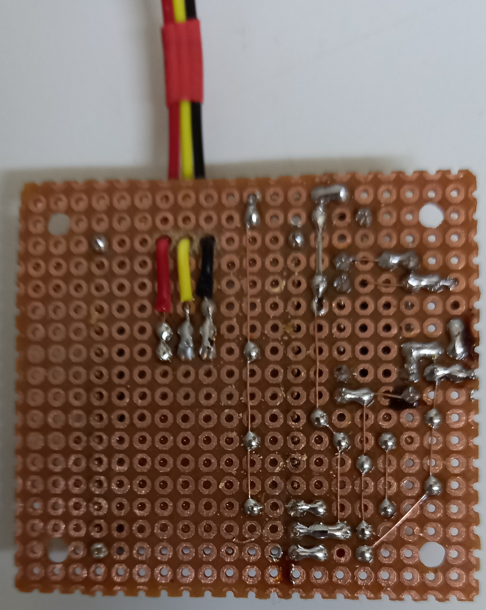

# ESP8266 home alarm with CallMeBot

## By Nelu-Ghiteanu

### Many thanks to Borja, the developer of CallMeBot, who facilitated my access to the API.

---
The CallMeBot API is great for setting up a small, very silent alarm that can be installed anywhere.
This provides us with real-time information about a potential intruder.
Alarming is done via a WhatsApp message. Implementation costs are minimal.

## Hardware used:
- ESP8266 NodeMCU 
- PIR sensor 
- 5v Relay
- BC547 transistor
- 1k resistor
- Header pins

### The code can be found in the .ino file.
Below are some images of my implementation along with a sketch:

------

